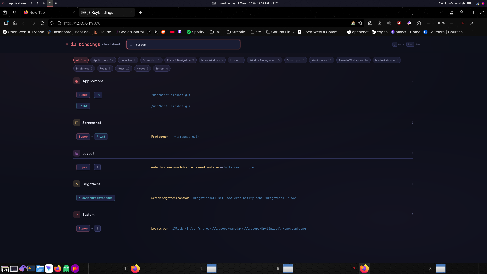

# ⌨ i3 Keybindings Cheatsheet

A live, searchable, editable cheatsheet for your i3 keybindings — served locally and opened from your polybar.



## What It Does

- **Parses your i3 config live** — always up to date, no manual maintenance
- **Categorizes bindings automatically** — apps, navigation, workspaces, media, system, etc.
- **Search and filter** — find any binding instantly by key or action
- **Inline editing** — click edit, change the binding, save — your i3 config updates and reloads
- **Polybar integration** — one click on the bar opens your cheatsheet in the browser
- **Auto-backup** — creates a timestamped backup before every edit

## How It Works

`i3-cheatsheet-server` is a lightweight Python HTTP server (zero dependencies, stdlib only) that:

1. Reads your `~/.config/i3/config` on every page load
2. Extracts all `bindsym` lines, resolves variables (`$super` → `Super`), and categorizes them
3. Serves a single HTML page with search, filtering, and inline editing
4. Saves edits back to your config and runs `i3-msg reload`

Listens on `127.0.0.1:9876` by default — localhost only, nothing exposed to your network.

## Install

```bash
git clone https://github.com/BalthazarVSBotWare/i3-keybindings-cheatsheet.git
cd i3-keybindings-cheatsheet
chmod +x install.sh
./install.sh
```

Or do it manually:

```bash
# Copy scripts
cp i3-cheatsheet-server ~/.local/bin/
cp i3-cheatsheet-open ~/.local/bin/
chmod +x ~/.local/bin/i3-cheatsheet-server ~/.local/bin/i3-cheatsheet-open

# Start the server
~/.local/bin/i3-cheatsheet-server &
```

Then open `http://127.0.0.1:9876` in your browser.

## Polybar Integration

Add this module to your polybar config:

```ini
[module/cheatsheet]
type = custom/text
format = "  ⌨  "
format-font = 1
format-foreground = ${colors.foreground-alt}
format-padding = 1
click-left = ~/.local/bin/i3-cheatsheet-open
```

Add `cheatsheet` to your `modules-center` (or wherever you want it):

```ini
modules-center = cheatsheet date openweathermap-fullfeatured
```

## i3 Autostart

Add this to your i3 config so the server starts on login:

```
exec --no-startup-id ~/.local/bin/i3-cheatsheet-server
```

Optionally bind a key to open it:

```
bindsym $super+Shift+i exec ~/.local/bin/i3-cheatsheet-open
```

## Tailscale / Remote Access

Want to check your keybindings from another device? Use the `--expose` flag:

```bash
~/.local/bin/i3-cheatsheet-server --expose
```

This binds to `0.0.0.0` instead of `127.0.0.1`, making it accessible over Tailscale or your LAN. Only do this on a trusted network.

## Keyboard Shortcuts (in the cheatsheet)

| Key | Action |
|-----|--------|
| `/` | Focus search |
| `Esc` | Clear search and filters |

## Requirements

- Python 3.6+
- i3wm
- A browser
- Polybar (optional, for the bar button)

## How Editing Works

1. Hover any binding → click **edit**
2. Modify the key combo or action (uses raw i3 syntax)
3. Click **Save & Reload**
4. Your config is backed up to `~/.config/i3/config.bak.YYYYMMDD_HHMMSS`
5. The change is written and `i3-msg reload` runs automatically

## License

MIT — see [LICENSE](LICENSE)
